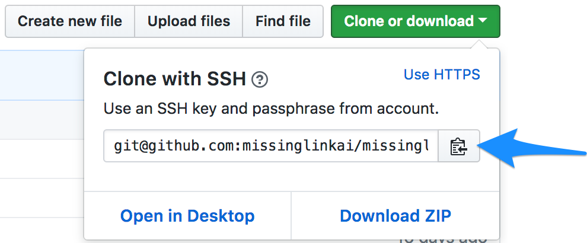
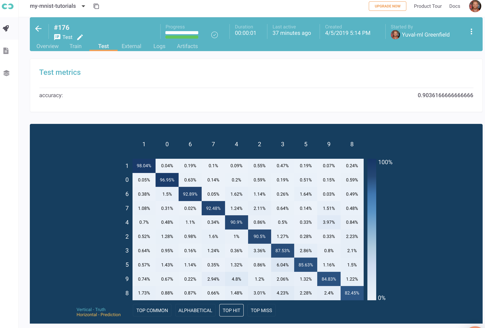

# Introduction

In this tutorial we will take the existing implementation of a deep learning algorithm and integrate it into the MissingLink system. 

We start with a [code sample](https://scikit-learn.org/stable/auto_examples/neural_networks/plot_mnist_filters.html) that trains a model based on the MNIST dataset using a multi-layer perceptron, and add the MissingLink SDK.

# Getting Started

## Prerequisites

To run this tutorial, you will need a MissingLink account. If you don't have one, [head to the MissingLink website and sign up](https://missinglink.ai/console/signup/userdetails).

You will also need to have [Python](https://www.python.org/downloads/) and [Docker](https://docs.docker.com/install/#supported-platforms) installed on your workstation.

---
**NOTE**

This tutorial assumes you’re using virtualenv to scope your working environment.
If you don't have it installed, you can follow [this guide](https://packaging.python.org/guides/installing-using-pip-and-virtualenv/) to get it set up.

---

## First things first ...

Notice it contains the program file, `mnist.py`, and a `requirements.txt` file.

To make changes, you will need to create a copy of the repo and fetch it to your local development environment. Clone this examples repository locally in your workstation. Click `Clone or download` in Github:


Now copy the URL for cloning the repository:



Next, let’s open a terminal and `git clone` using the pasted URL of your forked repository:  

```bash
$ git clone git@github.com:missinglinkai/examples.git
$ cd examples
```

Now that the code is on your machine, let's prepare the environment. Run the following commands:

```bash
$ cd examples/scikit-learn/tutorial
$ python3 -m virtualenv env
$ source env/bin/activate
$ pip install -r requirements.txt
```

## Let's run it

You can try to run the example:

```bash
$ python mnist.py
```

<!--  -->

As you can see, the code runs the experiment in a few epochs.

# Integrating the MissingLink SDK

Now, let's see how, by adding a few lines of code and a few commands, we're able to follow the experiment in MissingLink's web dashboard.

## Install and initialize the MissingLink CLI

MissingLink provides a command line interface (CLI) that allows you to control everything from the terminal.

Let's go ahead and install it:

```bash
$ pip install missinglink
```

Next, authenticate with the MissingLink backend.

---
**NOTE**

Once you run the following command, a browser window launches and accesses the MissingLink website.

If you're not logged on, you will be asked to log on. When the process is completed, you will get a message to go back to the terminal.


---

```bash
$ ml auth init
```

## Creating a project

MissingLink allows you to manage several projects. Let's create a new project for this tutorial:

```bash
$ ml projects create --display-name tutorials
```

---
**NOTE**

You can see a list of all your projects by running `ml projects list`, or by going to the [MissingLink web dashboard](https://missinglink.ai/console).

---

## Create the experiment in MissingLink

Open the `mnist.py` script file, import the MissingLink SDK and instantiate an `SkLearnProject`:
```diff
# ...
from sklearn.datasets import fetch_openml, get_data_home
from sklearn.neural_network import MLPClassifier

+import missinglink
+
+project = missinglink.SkLearnProject()

print(__doc__)

# Load data from https://www.openml.org/d/554
# ...
```

Now we need to define the different stages of the experiment in a context. Also we'll report the `accuracy` metric.

```diff
# ...
+with project.train(model) as train:
    print("fit")
    model.fit(data_train, target_train)
    data_train_pred = model.predict(data_train)
    accuracy = accuracy_score(target_train, data_train_pred)
+    train.add_metric('accuracy', accuracy)
    print("Training set accuracy: %f" % accuracy)
```

## Run the integrated experiment
We're all set up to run the experiment again, but this time to see it in the Missing Link dashboard.  

Go back to the terminal and run the script again:

```bash
$ python mnist.py
```

You should see the initialization and the beginning of training. Now, switch back to the MissingLink dashboard.

Open the [MissingLink dashboard](https://missinglink.ai/console) and click the projects toolbar button on the left. In this page, you should see the list of experiments that belong to your project.


Choose the **tutorials** project. Your experiment appears.  


---
**NOTE**

Feel free to browse through the different tabs of the experiment you're running and see how the metrics update as the experiment progresses. Check out https://missinglink.ai/docs for more information.

---

## Extra feature - confusion matrix and test data

By adding `add_test_data` you'll be able to see a visual, normalized confusion matrix in the `Test` tab of your experiment.

```diff
+with project.test() as test:
    print("test")
    data_test_pred = model.predict(data_test)
    accuracy = accuracy_score(target_test, data_test_pred)
+   test.add_metric('accuracy', accuracy)
+   test.add_test_data(target_test, data_test_pred)
    print("Test set accuracy: %f" % accuracy)
    print("Confusion matrix:")
    print(confusion_matrix(target_test, data_test_pred))
```



## Custom hyperparams

Many hyper parameters are captured automatically by MissingLink such as the model optimizer and parameters. We can record any other hyper parameter using the `set_hyperparams` method.

```diff
elif model_type == "forest":
    model = ensemble.RandomForestClassifier(n_estimators=20)

+project.set_hyperparams(split=split, rotate=rotate)
```

## Commit the code changes

Let's commit our code to the repo. Go to your terminal and run the following commands:

```bash
$ git add .
$ git commit -m "integrate with missinglink"
$ git push
```

# Summary

This tutorial demonstrated how to take an existing scikit learn code sample and integrate MissingLink's SDK with it. Your team now gained experimentation visibility and got a collaboration boost.

To learn more about what you can do, [head to the MissingLink docs](https://missinglink.ai/docs).